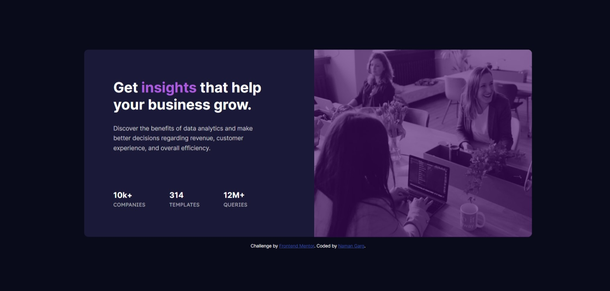

# Frontend Mentor - Stats preview card component solution

This is a solution to the [Stats preview card component challenge on Frontend Mentor](https://www.frontendmentor.io/challenges/stats-preview-card-component-8JqbgoU62). Frontend Mentor challenges help you improve your coding skills by building realistic projects. 

## Table of contents

- [Overview](#overview)
  - [The challenge](#the-challenge)
  - [Screenshot](#screenshot)
  - [Links](#links)
- [My process](#my-process)
  - [Built with](#built-with)
  - [What I learned](#what-i-learned)
  - [Continued development](#continued-development)
- [Author](#author)

## Overview

### The challenge

Users should be able to:

- View the optimal layout depending on their device's screen size

### Screenshot




### Links

- Solution URL: https://github.com/NamanG22/StatsCard
- Live Site URL: https://namang22.github.io/StatsCard/

## My process

### Built with

- Semantic HTML5 markup
- CSS custom properties
- Flexbox
- CSS Grid
- Mobile-first workflow

### What I learned

I thought position: absolute was pretty useless as it was fixed to viewport and it creates a lot of problem in creating the page repsonsive. But, I guess it can be used for some useful work. Maybe my thoughts would change further let's see.

When background color property doesn't work when I want to put color layer on top of grayscale image just take a solid color div and make it semi-transparent.

```html
 <div class="imgOverlay"></div>
 
```
```css
.imgMobile{
    width: 100%;
    display: block;
    border-radius: 10px;
}
.imgOverlay{
    width: 327px;
    background-color: hsl(278, 82%, 22%);
    opacity: 0.6;
    height: 240px;
    position: absolute;
    border-radius: 10px;
}
```

### Continued development

I wanna do the coding a bit faster because this project took me an entire day although that's beacuse I was trying out figma to get exact pixel perfect design, but that's very time consuming unless you are using pro in front end mentor.


## Author

- Frontend Mentor - [@NamanG22](https://www.frontendmentor.io/profile/NamanG22)
